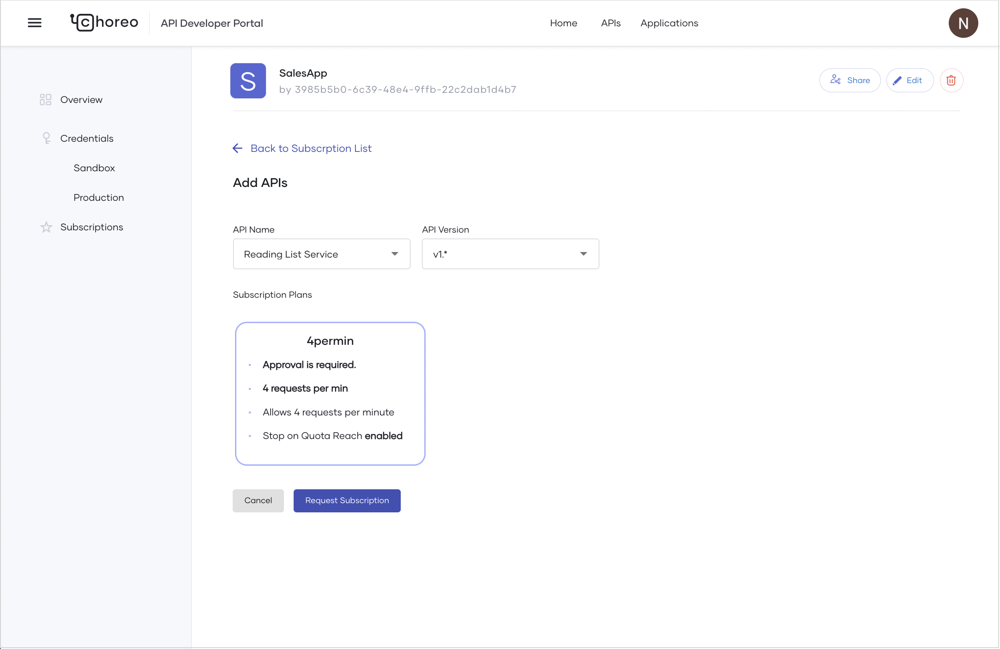

# Subscribe to an API with a Subscription Plan

If an API has subscription plans assigned to it, API consumers can select the subscription plan that best fits their requirements at the time of subscribing to the API.

To subscribe to an API with a subscription plan, follow the steps given below:

1. Sign in to the [Choreo Developer Portal](https://devportal.choreo.dev).
2. In the Developer Portal header, click **Applications**.
3. On the **My Applications** page, click on the application you want to use to subscribe to an API.
4. In the left navigation menu, click **Subscriptions**. 
5. In the **Subscription Management** pane that opens, click **+ Add APIs**.
6. In the **Add APIs** pane that opens, select the API, API version, and subscription plan with which you want to subscribe to the API.
7. Click **Add Subscription**.

    

8. If the selected subscription plan requires approval, your subscription will be shown as "Pending" until it is approved by an organization admin or the API publisher.

!!! note
    Subscription plans can be set to require approval. When enabled, an **API Publisher** or **Administrator** must approve subscription requests before they can be used. To configure this setting, see [Configuring Subscription Approval](./configure-subscription-approval.md).

To verify that the subscription plan works as expected, follow the steps given below:

1. In the Developer Portal header, click **APIs**.
2. Search for the API you subscribed to and click **Try Out**.
3. If your subscription is approved and active, invoke the API until you exceed the request limit set in the subscription plan. You will see that the API throttles further requests once the limit is reached.

    

4. If your subscription is still pending approval, you may see an error message indicating that you don't have an active subscription when trying to invoke the API.
